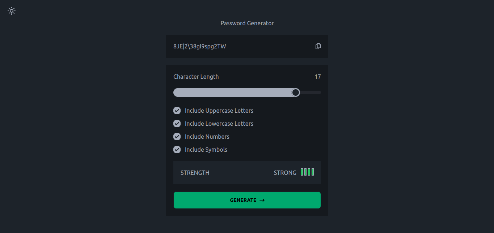

# Multi-step Form Challenge

This project is a solution to the Password generator app challenge from [Frontend Mentor](https://www.frontendmentor.io/challenges/password-generator-app-Mr8CLycqjh). The goal of the challenge was to generate random passwords.

## Table of Contents

- [Demo](#demo)
- [Screenshots](#screenshots)
- [Technologies Used](#technologies-used)
- [Features](#features)
- [Installation](#installation)

## Demo

You can view the live demo of the Password generator app [here](https://fm-password-generator-mu.vercel.app/).

## Screenshots



## Technologies Used

- Reactjs
- Tailwind-css
- TypeScript
- DaisyUI

## Features

- Generate a password based on the selected inclusion options
- Copy the generated password to the computer's clipboard
- See a strength rating for their generated password
- View the optimal layout for the interface depending on their device's screen size

## Installation

1. Clone the repository:

   ```bash
   git clone git@github.com:shamim-001/fm-password-generator.git
   ```

2. Navigate to the project directory:

   ```bash
   cd fm-password-generator
   ```

3. Install dependencies:

   ```bash
   pnpm install
   ```

4. Run the project on your local machine:

   ```bash
   pnpm run dev
   ```
